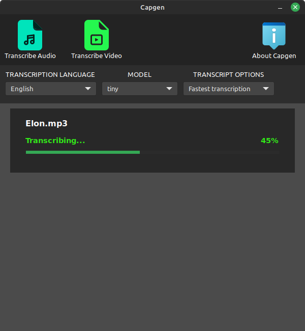

# Capgen


Capgen is an application that transcribes audio and video using [Whisper](https://openai.com/blog/whisper/) neural network created by
OpenAI. It has a minimal UI that makes it easier for absolutely anyone can use to transcribe or translate all sorts
of audio and videos such as podcasts, movies, documentaries, etc. Capgen is also
available as a Python command line application [here](https://github.com/iangitonga/capgen).

## Download
For Linux users, you can download the application [HERE](https://huggingface.co/iangitonga/capgen_models/resolve/main/Capgen.zip).
After downloading, unzip the archive and run the application executable.

## Features
- Source language transcription of audio and video.
- Source language to English translation.
- Tiny, base and small models available.
- Beamsearch and greedy decoding methods are available.

## TODO list
- Support Windows and Mac platforms.
- Provide GPU support.

## Architecture
Capgen is written entirely in C++ and C. It depends on the following libraries:

- [FFmpeg](https://github.com/FFmpeg/FFmpeg): Used to decode media files.
- [Libtorch](https://pytorch.org/cppdocs/index.html):Performs inference.
- [wxWidgets](https://www.wxwidgets.org/): Provides the graphical user interface.

## Build process(Linux platform)
**Capgen is designed so that it can be used on Linux, Windows and Mac but 
currently, it is tested on the Linux platform only.**

Before starting the build process ensure you have the following:

- **Cmake**: Capgen's build system.
- **GNU Make**: Builds the application.
- **Nasm** or **Yasm** assembler. Required to build FFmpeg.
- **Gtk+-3.0**: Required to build wxWidgets on **Linux**.
- **Libcurl**: Required to allow downloading ability.
- You can install all of these by running:
```
sudo apt-get install make cmake nasm gtk+-3.0 libcurl4-openssl-dev
```

Build the application by running the following commands:

```
git clone --recurse-submodules https://github.com/iangitonga/capgenx.git
cd capgenx/
python3 configure.py
mkdir build
cmake -S . -B build/ -DCMAKE_BUILD_TYPE=Release
cd build/
make
```

After build process is completed the built application is located in `capgenx/bin` directory from which you can run and test the application.

If you make changes in the source code, you can rebuild by just re-running `make` from the build directory.